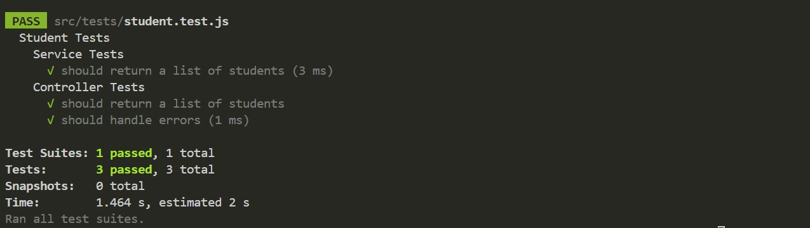

# Documentação de Testes Automatizados

## Introdução

Este documento descreve os testes automatizados desenvolvidos para a funcionalidade de puxar estudantes da API do projeto Fly. Os testes foram criados para validar a integridade e a funcionalidade do serviço de alunos.

## Testes Implementados

### Service Tests

- **Descrição:** Verifica se o serviço retorna corretamente a lista de estudantes do banco de dados.
- **Cenário Testado:** Chamada do método `getAllStudents` no serviço de alunos.
- **Expectativa:** O serviço deve retornar uma lista dos estudantes cadastrados com todas as informações necessárias.

### Controller Tests

- **Descrição:** Confirma que o controlador responde corretamente com a lista de estudantes em formato JSON para a rota especificada.
- **Cenário Testado:** Requisição GET para a rota `/students`.
- **Expectativa:** O controlador deve responder com uma resposta JSON contendo a lista de estudantes conforme retornada pelo serviço `getAllStudents`.

- **Descrição:** Assegura que o controlador lida com erros apropriadamente.
- **Cenário Testado:** Simulação de uma falha no serviço ao chamar `getAllStudents`.
- **Expectativa:** O controlador deve retornar uma resposta de erro com status HTTP 500 e uma mensagem de erro correspondente.

## Executando os Testes

Para executar os testes automatizados, siga as instruções abaixo:

1. Certifique-se de ter o ambiente de desenvolvimento configurado com Node.js e npm.
2. Instale as dependências do projeto: `npm install`
3. Execute os testes automatizados: `npm run test`

## Resultados Obtidos

Após a execução dos testes, verifique os resultados no terminal. Todos os testes devem ter sido executados com sucesso, garantindo o correto funcionamento do serviço de puxar estudantes da API.