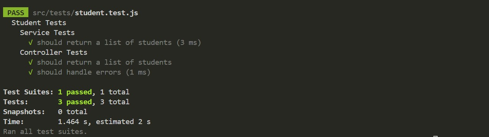

# Documentação de Testes Automatizados

## Introdução

Este documento descreve os testes automatizados desenvolvidos para a funcionalidade de puxar estudantes da API do projeto Fly. Os testes foram criados para validar a integridade e a funcionalidade do serviço de alunos.

## Testes Implementados

### Service Tests

#### Teste 1: getAllStudents retorna lista de estudantes

- *Objetivo:* Verificar se a lista completa de estudantes é retornada.
- *Pré-condição:* Banco de dados contém registros de estudantes.
- *Procedimento de Teste:* Invocar o método getAllStudents.
- *Resultado Esperado:* Uma lista contendo todos os registros de estudantes é retornada.
- *Resultado Obtido:* Lista de estudantes retornada com sucesso.
- *Pós-condição:* Nenhuma alteração no estado do banco de dados.

### Controller Tests

#### Teste 2: getAllStudents manipula requisição e resposta corretamente

- *Objetivo:* Confirmar que a rota de obtenção de todos os estudantes funciona conforme esperado.
- *Pré-condição:* Rota /students é acessada.
- *Procedimento de Teste:* Enviar uma requisição GET para a rota /students.
- *Resultado Esperado:* O controlador responde com a lista completa de registros de estudantes.
- *Resultado Obtido:* Lista completa de estudantes retornada com sucesso.
- *Pós-condição:* Estado do banco de dados inalterado.

## Executando os Testes

Para executar os testes automatizados, siga as instruções abaixo:

1. Certifique-se de ter o ambiente de desenvolvimento configurado com Node.js e npm.
2. Instale as dependências do projeto: `npm install`
3. Execute os testes automatizados: `npm run test`

## Resultados Obtidos

Após a execução dos testes, verifique os resultados no terminal. Todos os testes devem ter sido executados com sucesso, garantindo o correto funcionamento do serviço de puxar estudantes da API.